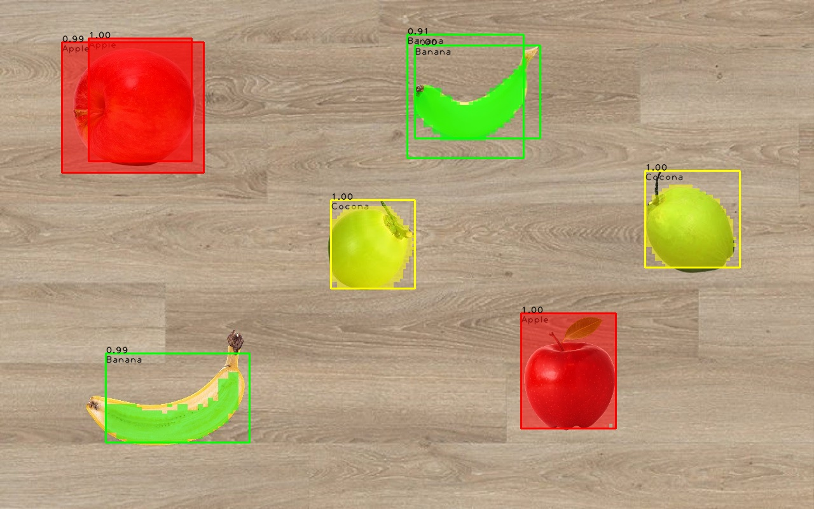

# Understand-MaskRCNN
Understand-MaskRCNN is a extremely simple FasterRCNN, MaskRCNN repo for explaining how it works.

## About The Project
* The main purpose of this project is creating a easy to understand code, because FasterRCNN/MaskRCNN is still the strongest basline in two-stage object detection algorithm so far. I try to avoid using extra packages, so that users don't need to install and take time to learn other works.  

* Furthermore, I try to unlock every black box in the algorithm. It allows whether you are a beginner, half-understanding, or only unclear one or two points, you can fully understand it through this project.  

* Note: If you want a powerful and efficient MaskRCNN tool. Please refer to [Detectron2](https://github.com/facebookresearch/detectron2), [maskrcnn-benchmark](https://github.com/facebookresearch/maskrcnn-benchmark), [mmdetection](https://github.com/open-mmlab/mmdetection) (Pytorch),and [Tensorflow Object Detection API](https://github.com/tensorflow/models/tree/master/research/object_detection) , [matterport](https://github.com/matterport/Mask_RCNN) (Tensorflow)

## Installation
```sh 
pip install numpy
pip install opencv-python
pip install torch==1.4.0 torchvision==0.5.0
```

## Getting Started
### Train
Open MaskRCNN/main.py
```python
data_path = os.path.join(os.path.dirname(os.getcwd()), 'dataset')
train_net(data_path, max_epoch = 300)
```

### Inference
Open MaskRCNN/main.py
```python
data_path = os.path.join(os.path.dirname(os.getcwd()), 'dataset')
inference(data_path, score_thresh = 0.8)
```



## TODO

- [x] Region Proposal Network
- [x] Faster RCNN
- [x] Mask RCNN
- [ ] The article of Understand-MaskRCNN
- [ ] Flexible anchors mask rcnn
